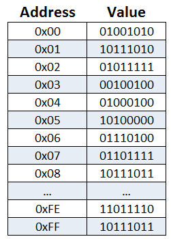

# 什么是程序
计算机程序是指令和数据的集合, 通常有输入，处理，输出三个部分组成。

程序是运行在内存中的。内存是由地址和地址所对应的数据组成。每个地址空间存储1个Byte数据（8个bit）见下图：




# 计算机语言发展
## 早期计算机编程语言
Machine Language（机器语言）-> 汇编语言（基本和机器语言差不多，只是增加了可读性）

## 高级计算机语言
### 编译型语言
 - 面向过程： C， Fortran。
 - 面向对象： C++, Java

### 脚本语言
Python, JavaScript, PHP, Shell, Ruby

# 什么是 Python？
Python 是一种编程语言，广泛用于 Web 应用程序、软件开发、数据科学和机器学习 (ML)。开发人员使用 Python 是因为其高效和易于学习，并且可以在许多不同的平台上运行。Python 软件可供免费下载，可与所有类型的系统完美集成，并且还可以提高开发速度。（Glue Language）


# Python 有哪些优势？
Python 的优势包括：
- 开发人员可以轻松阅读和理解 Python 程序，因为其具有像英语一样的基本语法。 
- Python 可提高开发人员的效率，因为与许多其他语言相比，开发人员使用较少行数的代码即可编写 Python 程序。
- Python 具有大型标准库，包含适用于几乎任何任务的可重复使用代码。因此，开发人员不必从头开始编写代码。
- 开发人员可以轻松使用 Python 搭配其他受欢迎的编程语言（例如 Java、C 和 C++）。
- 活跃的 Python 社群包括来自全球的数百万名开发人员，可提供支持。如果您遇到问题，您可以从社群获得快速支持。
- 如果您想学习 Python，海量有帮助的资源遍布互联网。例如，您可以轻松找到视频、教程、文档和开发人员指南。
- Python 可在不同的计算机操作系统（例如 Windows、macOS、Linux 和 Unix）之间迁移。

# 下载安装 Python
https://www.python.org/downloads/

# Python 版本
目前主流的 Python 版本为 Python 3.x 不过需要知道的是Python有过一个大的版本更新：

Python 的 3​​.0 版本相对于 Python 的早期版本，这是一个较大的升级。为了不带入过多的累赘，Python 3.0 在设计的时候没有考虑向下相容。
许多针对早期 Python 版本设计的程式都无法在 Python 3.0 上正常执行。
在Python 3.0 之前的版本是Python 2.7 此版本已经在2020年1月1日之后停止维护了，也就意味着Python 2.7 中的一些Bug和功能不再得到更新和补丁。[Sunsetting Python 2](https://www.python.org/doc/sunset-python-2/)

所以只需要学习Python 3.0之后的版本就好，只是需要留意之前版本的Python代码在新的版本中可能会出现运行错误。


# 第一个Python程序：

```Python
print("Hello World!")
```

# Python 的基本数据类型
## 有用的命令： `print()`, `type()`
### `print()` 函数
`print()`函数将其中的数据内容转换为字符串，并输出到屏幕上。
```Python
>>> a = 1
>>> print(a)
1
>>> print("Hello World")
```

### `type()` 函数
`type()`函数返回对象的类型。
```Python
>>> a = 1
>>> type(a)
<class 'int'>
```

## 整数 Integers
在Python 3 中，整数值的长度实际上没有限制。只要你的内存空间允许，整数可以存储任何你需要的数据长度。

``` Python
>>> print(123123123123123123123123123123123123123123123123 + 1)
123123123123123123123123123123123123123123123124
```

Python 将没有任何前缀的十进制数字序列解释为十进制数：
``` Python
>>> print(10)
10
```

## 浮点数 Floating-Point Numbers 
Python 中的`float`类型指的是浮点数（近似于数学中的小数）。`float`值用小数点指定。或者，可以通过字符e或E后加上正整数或负整数来指定科学记数法：`1.23e2` 或 `2.45E-4`

```Python
>>> 4.2
4.2
>>> type(4.2)
<class 'float'>
>>> 4.
4.0
>>> .2
0.2

>>> .4e7
4000000.0
>>> type(.4e7)
<class 'float'>
>>> 4.2e-4
0.00042
```

### 注意：

由于Python中的`float`类型基于[IEEE754双精度浮点标准](https://zh.wikipedia.org/wiki/%E9%9B%99%E7%B2%BE%E5%BA%A6%E6%B5%AE%E9%BB%9E%E6%95%B8)。 浮点类型并不能表示所有的实数(有效数字或者精度有限)，并且存储数字的范围有限。

运行以下代码来测试Python浮点数精度：[testFloat.py](./testFloat.py)
```
python testFloat.py
```
## 布尔值 Boolean
Python 3 提供了布尔数据类型。布尔类型的对象可以具有两个值之一，`True`或`False`：
```Python
>>> type(True)
<class 'bool'>
>>> type(False)
<class 'bool'>
```

## 复数 Complex Numbers

## 字符串 Strings
字符串(String)是由数字、字母、下划线组成的一串字符。字符串类型在Python中称为`str`
和整数一样，Python中字符串的长度没有限制，唯有你的电脑内存限制你可以存储的字符串长度。


# 操作符 operators
## 算术运算符 Arithmetic Operators

| 运算符 | 描述 | 语法 |
|:---:|:----------------------------:|:-------:|
| +   | 加 - 两个对象相加 |x + y|
| -   | 减 - 得到负数或是一个数减去另一个数 |x – y|
| *   | 乘 - 两个数相乘或是返回一个被重复若干次的字符串 |x * y|
| /   | 除 - x除以y |x / y|
| //  | 取整除 - 返回商的整数部分（向下取整） |x // y|
| %   | 取模 - 返回除法的余数 |x % y|
| **  | 幂 - 返回x的y次幂 |x ** y |

## 比较运算符 Comparison Operators
所有比较运算符返回1表示真，返回0表示假。这分别与特殊的变量 True 和 False 等价。

| 运算符 | 描述 |  语法 |
|:---:|:---:|:---:|
| == | 等于 - 比较对象是否相等 | x == y |
| != | 不等于 - 比较两个对象是否不相等 | x != y |
| > | 大于 - 返回x是否大于y | x > y |
| < | 小于 - 返回x是否小于y | x < y |
| >= | 大于等于 - 返回x是否大于等于y| x >= y |
| <= | 小于等于 - 返回x是否小于等于y | x <= y |

## 赋值运算符 Assignment Operators
| 运算符 | 描述 |  语法 |
|:---:|:---:|:---:|
| = | 简单的赋值运算符 | x = y + z 将 y + z 的运算结果赋值为 x  |
| += | 加法赋值运算符 | x += y 等效于 x = x + y  |

## 逻辑运算符 Logical Operators

## 位运算符 Bitwise Operators

## 身份运算符和成员运算符 Identity Operators and Membership Operators